# 导入工具包


```python
import numpy as np
import pandas as pd

pd.set_option('display.max_columns', 60)

import matplotlib.pyplot as plt
%matplotlib inline

plt.rcParams['font.size'] = 24
plt.rcParams['font.sans-serif'] = ['Microsoft YaHei']

import seaborn as sns

import warnings
warnings.filterwarnings('ignore')


```

# 一 获取数据

##  1 加载数据


```python
dataset = pd.read_csv('data.csv')
```

## 2 数据清洗


```python
dataset.head()
```


<div>
<style scoped>
    .dataframe tbody tr th:only-of-type {
        vertical-align: middle;
    }

    .dataframe tbody tr th {
        vertical-align: top;
    }

    .dataframe thead th {
        text-align: right;
    }
</style>
<table border="1" class="dataframe">
  <thead>
    <tr style="text-align: right;">
      <th></th>
      <th>面积</th>
      <th>室</th>
      <th>厅</th>
      <th>厨</th>
      <th>卫</th>
      <th>车位</th>
      <th>学区房</th>
      <th>是否地铁房名称</th>
      <th>业主房评</th>
      <th>VR</th>
      <th>状态</th>
      <th>一级委托</th>
      <th>二级委托</th>
      <th>等级</th>
      <th>商圈</th>
      <th>城区</th>
      <th>价格</th>
    </tr>
  </thead>
  <tbody>
    <tr>
      <td>0</td>
      <td>62.00</td>
      <td>2</td>
      <td>1</td>
      <td>1</td>
      <td>1</td>
      <td>0</td>
      <td>0</td>
      <td>否</td>
      <td>0</td>
      <td>0</td>
      <td>房源不呈现</td>
      <td>人际开发</td>
      <td>转介绍</td>
      <td>B级房源</td>
      <td>信义坊</td>
      <td>拱墅区</td>
      <td>230.0</td>
    </tr>
    <tr>
      <td>1</td>
      <td>77.00</td>
      <td>3</td>
      <td>1</td>
      <td>1</td>
      <td>1</td>
      <td>0</td>
      <td>0</td>
      <td>未知</td>
      <td>1</td>
      <td>0</td>
      <td>房源在售</td>
      <td>链家网</td>
      <td>链家网</td>
      <td>B级房源</td>
      <td>富阳</td>
      <td>富阳区</td>
      <td>170.0</td>
    </tr>
    <tr>
      <td>2</td>
      <td>76.00</td>
      <td>2</td>
      <td>2</td>
      <td>1</td>
      <td>1</td>
      <td>0</td>
      <td>0</td>
      <td>是</td>
      <td>0</td>
      <td>1</td>
      <td>房源不呈现</td>
      <td>二次开发</td>
      <td>业主资料</td>
      <td>B级房源</td>
      <td>钱江世纪城</td>
      <td>萧山区</td>
      <td>380.0</td>
    </tr>
    <tr>
      <td>3</td>
      <td>87.19</td>
      <td>2</td>
      <td>2</td>
      <td>1</td>
      <td>1</td>
      <td>0</td>
      <td>0</td>
      <td>未知</td>
      <td>0</td>
      <td>0</td>
      <td>房源在售</td>
      <td>人际开发</td>
      <td>转介绍</td>
      <td>B级房源</td>
      <td>未来科技城</td>
      <td>余杭区</td>
      <td>158.0</td>
    </tr>
    <tr>
      <td>4</td>
      <td>102.06</td>
      <td>3</td>
      <td>2</td>
      <td>1</td>
      <td>2</td>
      <td>0</td>
      <td>0</td>
      <td>是</td>
      <td>0</td>
      <td>1</td>
      <td>房源在售</td>
      <td>二次开发</td>
      <td>老客户</td>
      <td>B级房源</td>
      <td>体育场路</td>
      <td>下城区</td>
      <td>410.0</td>
    </tr>
  </tbody>
</table>
</div>


共有18个属性：建筑面积，户型格局-室等等

为了方便查看数据，我们对数据属性名进行一些转换


```python
dataset.rename(columns={'户型格局-室':'室','户型格局-厅':'厅','户型格局-厨':'厨',
                        '户型格局-卫':'卫','是否有学区名额':'学区房',
                        '是否地铁房名称':'地铁房','是否有业主房评':'业主房评',
                        '是否有车位':'车位',
                        '建筑面积':'面积','是否VR房':'VR','贝壳网呈现状态名称':'状态',
                        '一级委托来源':'一级委托','二级委托来源':'二级委托','商圈名称':'商圈',
                        '城区名称':'城区'},inplace=True)
```


```python
dataset.head(10)
```


<div>
<style scoped>
    .dataframe tbody tr th:only-of-type {
        vertical-align: middle;
    }

    .dataframe tbody tr th {
        vertical-align: top;
    }

    .dataframe thead th {
        text-align: right;
    }
</style>
<table border="1" class="dataframe">
  <thead>
    <tr style="text-align: right;">
      <th></th>
      <th>面积</th>
      <th>室</th>
      <th>厅</th>
      <th>厨</th>
      <th>卫</th>
      <th>车位</th>
      <th>学区房</th>
      <th>地铁房</th>
      <th>业主房评</th>
      <th>VR</th>
      <th>状态</th>
      <th>一级委托</th>
      <th>二级委托</th>
      <th>等级</th>
      <th>商圈</th>
      <th>城区</th>
      <th>价格</th>
    </tr>
  </thead>
  <tbody>
    <tr>
      <td>0</td>
      <td>62.00</td>
      <td>2</td>
      <td>1</td>
      <td>1</td>
      <td>1</td>
      <td>0</td>
      <td>0</td>
      <td>否</td>
      <td>0</td>
      <td>0</td>
      <td>房源不呈现</td>
      <td>人际开发</td>
      <td>转介绍</td>
      <td>B级房源</td>
      <td>信义坊</td>
      <td>拱墅区</td>
      <td>230.0</td>
    </tr>
    <tr>
      <td>1</td>
      <td>77.00</td>
      <td>3</td>
      <td>1</td>
      <td>1</td>
      <td>1</td>
      <td>0</td>
      <td>0</td>
      <td>未知</td>
      <td>1</td>
      <td>0</td>
      <td>房源在售</td>
      <td>链家网</td>
      <td>链家网</td>
      <td>B级房源</td>
      <td>富阳</td>
      <td>富阳区</td>
      <td>170.0</td>
    </tr>
    <tr>
      <td>2</td>
      <td>76.00</td>
      <td>2</td>
      <td>2</td>
      <td>1</td>
      <td>1</td>
      <td>0</td>
      <td>0</td>
      <td>是</td>
      <td>0</td>
      <td>1</td>
      <td>房源不呈现</td>
      <td>二次开发</td>
      <td>业主资料</td>
      <td>B级房源</td>
      <td>钱江世纪城</td>
      <td>萧山区</td>
      <td>380.0</td>
    </tr>
    <tr>
      <td>3</td>
      <td>87.19</td>
      <td>2</td>
      <td>2</td>
      <td>1</td>
      <td>1</td>
      <td>0</td>
      <td>0</td>
      <td>未知</td>
      <td>0</td>
      <td>0</td>
      <td>房源在售</td>
      <td>人际开发</td>
      <td>转介绍</td>
      <td>B级房源</td>
      <td>未来科技城</td>
      <td>余杭区</td>
      <td>158.0</td>
    </tr>
    <tr>
      <td>4</td>
      <td>102.06</td>
      <td>3</td>
      <td>2</td>
      <td>1</td>
      <td>2</td>
      <td>0</td>
      <td>0</td>
      <td>是</td>
      <td>0</td>
      <td>1</td>
      <td>房源在售</td>
      <td>二次开发</td>
      <td>老客户</td>
      <td>B级房源</td>
      <td>体育场路</td>
      <td>下城区</td>
      <td>410.0</td>
    </tr>
    <tr>
      <td>5</td>
      <td>84.69</td>
      <td>2</td>
      <td>2</td>
      <td>1</td>
      <td>1</td>
      <td>0</td>
      <td>1</td>
      <td>是</td>
      <td>0</td>
      <td>1</td>
      <td>房源在售</td>
      <td>实体开发</td>
      <td>店面接待</td>
      <td>B级房源</td>
      <td>文一西路</td>
      <td>西湖区</td>
      <td>525.0</td>
    </tr>
    <tr>
      <td>6</td>
      <td>254.27</td>
      <td>4</td>
      <td>3</td>
      <td>1</td>
      <td>3</td>
      <td>1</td>
      <td>0</td>
      <td>是</td>
      <td>0</td>
      <td>0</td>
      <td>房源在售</td>
      <td>人际开发</td>
      <td>转介绍</td>
      <td>B级房源</td>
      <td>彩虹城</td>
      <td>滨江区</td>
      <td>1000.0</td>
    </tr>
    <tr>
      <td>7</td>
      <td>82.19</td>
      <td>2</td>
      <td>1</td>
      <td>1</td>
      <td>1</td>
      <td>0</td>
      <td>0</td>
      <td>是</td>
      <td>1</td>
      <td>1</td>
      <td>房源在售</td>
      <td>人际开发</td>
      <td>转介绍</td>
      <td>B级房源</td>
      <td>高教园区东</td>
      <td>江干区</td>
      <td>280.0</td>
    </tr>
    <tr>
      <td>8</td>
      <td>102.00</td>
      <td>3</td>
      <td>2</td>
      <td>1</td>
      <td>1</td>
      <td>0</td>
      <td>0</td>
      <td>是</td>
      <td>0</td>
      <td>1</td>
      <td>房源在售</td>
      <td>人际开发</td>
      <td>转介绍</td>
      <td>B级房源</td>
      <td>嘉绿</td>
      <td>西湖区</td>
      <td>500.0</td>
    </tr>
    <tr>
      <td>9</td>
      <td>92.79</td>
      <td>3</td>
      <td>1</td>
      <td>1</td>
      <td>1</td>
      <td>0</td>
      <td>0</td>
      <td>是</td>
      <td>0</td>
      <td>0</td>
      <td>房源不呈现</td>
      <td>人际开发</td>
      <td>物业开发</td>
      <td>B级房源</td>
      <td>文三西路</td>
      <td>西湖区</td>
      <td>340.0</td>
    </tr>
  </tbody>
</table>
</div>


```python
dataset.info()
```

    <class 'pandas.core.frame.DataFrame'>
    RangeIndex: 20000 entries, 0 to 19999
    Data columns (total 17 columns):
    面积      20000 non-null float64
    室       20000 non-null int64
    厅       20000 non-null int64
    厨       20000 non-null int64
    卫       20000 non-null int64
    车位      20000 non-null int64
    学区房     20000 non-null int64
    地铁房     20000 non-null object
    业主房评    20000 non-null int64
    VR      20000 non-null int64
    状态      20000 non-null object
    一级委托    20000 non-null object
    二级委托    20000 non-null object
    等级      20000 non-null object
    商圈      20000 non-null object
    城区      20000 non-null object
    价格      20000 non-null float64
    dtypes: float64(2), int64(8), object(7)
    memory usage: 2.6+ MB
    

可是属性没有缺失值,所以不需要进行缺失值处理


```python
dataset.describe()
```


<div>
<style scoped>
    .dataframe tbody tr th:only-of-type {
        vertical-align: middle;
    }

    .dataframe tbody tr th {
        vertical-align: top;
    }

    .dataframe thead th {
        text-align: right;
    }
</style>
<table border="1" class="dataframe">
  <thead>
    <tr style="text-align: right;">
      <th></th>
      <th>面积</th>
      <th>室</th>
      <th>厅</th>
      <th>厨</th>
      <th>卫</th>
      <th>车位</th>
      <th>学区房</th>
      <th>业主房评</th>
      <th>VR</th>
      <th>价格</th>
    </tr>
  </thead>
  <tbody>
    <tr>
      <td>count</td>
      <td>20000.000000</td>
      <td>20000.000000</td>
      <td>20000.00000</td>
      <td>20000.000000</td>
      <td>20000.000000</td>
      <td>20000.000000</td>
      <td>20000.00000</td>
      <td>20000.000000</td>
      <td>20000.000000</td>
      <td>20000.000000</td>
    </tr>
    <tr>
      <td>mean</td>
      <td>103.403553</td>
      <td>2.598200</td>
      <td>1.53940</td>
      <td>0.972050</td>
      <td>1.467100</td>
      <td>0.098400</td>
      <td>0.21720</td>
      <td>0.024450</td>
      <td>0.367250</td>
      <td>362.936515</td>
    </tr>
    <tr>
      <td>std</td>
      <td>61.546833</td>
      <td>1.110414</td>
      <td>0.61609</td>
      <td>0.223095</td>
      <td>0.734673</td>
      <td>0.297862</td>
      <td>0.41235</td>
      <td>0.154445</td>
      <td>0.482067</td>
      <td>301.647119</td>
    </tr>
    <tr>
      <td>min</td>
      <td>3.860000</td>
      <td>0.000000</td>
      <td>0.00000</td>
      <td>0.000000</td>
      <td>0.000000</td>
      <td>0.000000</td>
      <td>0.00000</td>
      <td>0.000000</td>
      <td>0.000000</td>
      <td>12.800000</td>
    </tr>
    <tr>
      <td>25%</td>
      <td>62.687500</td>
      <td>2.000000</td>
      <td>1.00000</td>
      <td>1.000000</td>
      <td>1.000000</td>
      <td>0.000000</td>
      <td>0.00000</td>
      <td>0.000000</td>
      <td>0.000000</td>
      <td>200.000000</td>
    </tr>
    <tr>
      <td>50%</td>
      <td>89.000000</td>
      <td>3.000000</td>
      <td>2.00000</td>
      <td>1.000000</td>
      <td>1.000000</td>
      <td>0.000000</td>
      <td>0.00000</td>
      <td>0.000000</td>
      <td>0.000000</td>
      <td>290.000000</td>
    </tr>
    <tr>
      <td>75%</td>
      <td>128.980000</td>
      <td>3.000000</td>
      <td>2.00000</td>
      <td>1.000000</td>
      <td>2.000000</td>
      <td>0.000000</td>
      <td>0.00000</td>
      <td>0.000000</td>
      <td>1.000000</td>
      <td>430.000000</td>
    </tr>
    <tr>
      <td>max</td>
      <td>889.000000</td>
      <td>10.000000</td>
      <td>9.00000</td>
      <td>9.000000</td>
      <td>9.000000</td>
      <td>1.000000</td>
      <td>1.00000</td>
      <td>1.000000</td>
      <td>1.000000</td>
      <td>7000.000000</td>
    </tr>
  </tbody>
</table>
</div>


可以看出价格平均数为362万左右，中位数在290万左右，说明少数房价较高拉高了平均值

且发现是否有车位、是否是学区房有负值。用value_counts查看


```python
dataset['车位'].value_counts()
```


    0    18032
    1     1968
    Name: 车位, dtype: int64


```python
dataset['学区房'].value_counts()
```


    0    15656
    1     4344
    Name: 学区房, dtype: int64


由业务知识知，0和-1都应该是指无，只是记录方法不同。所以我们将-1值转换为0


```python
dataset.replace({'车位':-1,'学区房':-1},0,inplace=True)
```


```python
dataset.describe()
```


<div>
<style scoped>
    .dataframe tbody tr th:only-of-type {
        vertical-align: middle;
    }

    .dataframe tbody tr th {
        vertical-align: top;
    }

    .dataframe thead th {
        text-align: right;
    }
</style>
<table border="1" class="dataframe">
  <thead>
    <tr style="text-align: right;">
      <th></th>
      <th>面积</th>
      <th>室</th>
      <th>厅</th>
      <th>厨</th>
      <th>卫</th>
      <th>车位</th>
      <th>学区房</th>
      <th>业主房评</th>
      <th>VR</th>
      <th>价格</th>
    </tr>
  </thead>
  <tbody>
    <tr>
      <td>count</td>
      <td>20000.000000</td>
      <td>20000.000000</td>
      <td>20000.00000</td>
      <td>20000.000000</td>
      <td>20000.000000</td>
      <td>20000.000000</td>
      <td>20000.00000</td>
      <td>20000.000000</td>
      <td>20000.000000</td>
      <td>20000.000000</td>
    </tr>
    <tr>
      <td>mean</td>
      <td>103.403553</td>
      <td>2.598200</td>
      <td>1.53940</td>
      <td>0.972050</td>
      <td>1.467100</td>
      <td>0.098400</td>
      <td>0.21720</td>
      <td>0.024450</td>
      <td>0.367250</td>
      <td>362.936515</td>
    </tr>
    <tr>
      <td>std</td>
      <td>61.546833</td>
      <td>1.110414</td>
      <td>0.61609</td>
      <td>0.223095</td>
      <td>0.734673</td>
      <td>0.297862</td>
      <td>0.41235</td>
      <td>0.154445</td>
      <td>0.482067</td>
      <td>301.647119</td>
    </tr>
    <tr>
      <td>min</td>
      <td>3.860000</td>
      <td>0.000000</td>
      <td>0.00000</td>
      <td>0.000000</td>
      <td>0.000000</td>
      <td>0.000000</td>
      <td>0.00000</td>
      <td>0.000000</td>
      <td>0.000000</td>
      <td>12.800000</td>
    </tr>
    <tr>
      <td>25%</td>
      <td>62.687500</td>
      <td>2.000000</td>
      <td>1.00000</td>
      <td>1.000000</td>
      <td>1.000000</td>
      <td>0.000000</td>
      <td>0.00000</td>
      <td>0.000000</td>
      <td>0.000000</td>
      <td>200.000000</td>
    </tr>
    <tr>
      <td>50%</td>
      <td>89.000000</td>
      <td>3.000000</td>
      <td>2.00000</td>
      <td>1.000000</td>
      <td>1.000000</td>
      <td>0.000000</td>
      <td>0.00000</td>
      <td>0.000000</td>
      <td>0.000000</td>
      <td>290.000000</td>
    </tr>
    <tr>
      <td>75%</td>
      <td>128.980000</td>
      <td>3.000000</td>
      <td>2.00000</td>
      <td>1.000000</td>
      <td>2.000000</td>
      <td>0.000000</td>
      <td>0.00000</td>
      <td>0.000000</td>
      <td>1.000000</td>
      <td>430.000000</td>
    </tr>
    <tr>
      <td>max</td>
      <td>889.000000</td>
      <td>10.000000</td>
      <td>9.00000</td>
      <td>9.000000</td>
      <td>9.000000</td>
      <td>1.000000</td>
      <td>1.00000</td>
      <td>1.000000</td>
      <td>1.000000</td>
      <td>7000.000000</td>
    </tr>
  </tbody>
</table>
</div>


## 3 EDA分析

## 3.1 单变量


```python
plt.figure(figsize=(12,8))

plt.hist(dataset['价格'],bins=100,edgecolor='k')
plt.xlabel('价格')
plt.ylabel('价格计数')
plt.title('价格分布')
```


    Text(0.5, 1.0, '价格分布')


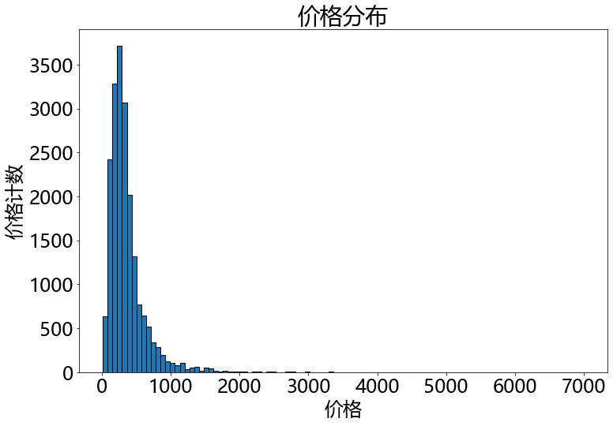


可以看出价格大部分集中在1000万以下，让我们看看1000万以下数据分布


```python
plt.figure(figsize=(12,8))

plt.hist(dataset[dataset['价格']<=1000]['价格'],bins=100,edgecolor='k')
plt.xlabel('价格')
plt.ylabel('价格计数')
plt.title('价格分布')
```


    Text(0.5, 1.0, '价格分布')


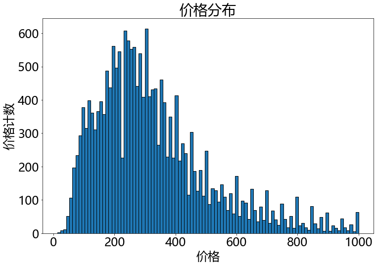


可以清楚的看出价格呈现一种右偏分布，主要集中在100万到500万之间

接下来再看看面积分布


```python
plt.figure(figsize=(12,8))

plt.hist(dataset['面积'],bins=100,edgecolor='k')
plt.xlabel('面积')
plt.ylabel('面积计数')
plt.title('面积分布')
```


    Text(0.5, 1.0, '面积分布')


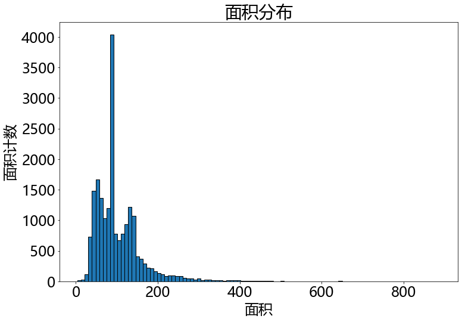


```python
plt.figure(figsize=(12,8))

plt.hist(dataset[dataset['面积']<=250]['面积'],bins=100,edgecolor='k')
plt.xlabel('面积')
plt.ylabel('面积计数')
plt.title('面积分布')
```


    Text(0.5, 1.0, '面积分布')


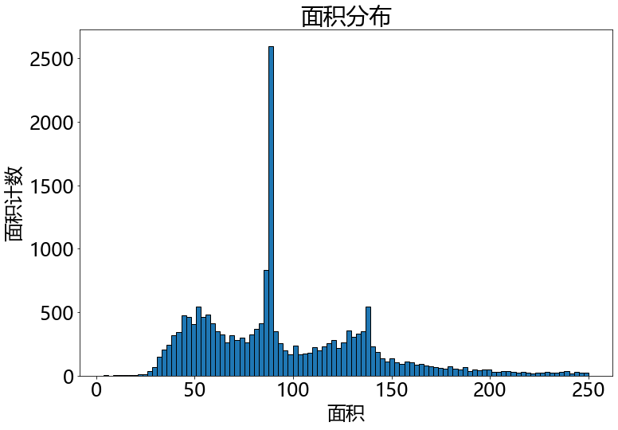


可以看出面积有三个峰值，50,90,140左右，符合印象中一室，二室，三室的面积分布，后续再分析，面积与室数的分布

### 3.2 观察哪些变量会对结果产生影响


```python
types = dataset['面积'].value_counts()
types = types[types>60].index
```


```python
plt.figure(figsize=(12,10))

for b_type in types:
    subset = dataset[dataset['面积'] == b_type]
    
    sns.kdeplot(subset['价格'],label=b_type,shade=False,alpha=0.8)

plt.xlabel('价格', size = 20);
plt.ylabel('面积', size = 20); 
plt.title('不同面积下价格密度图', size = 28);
```


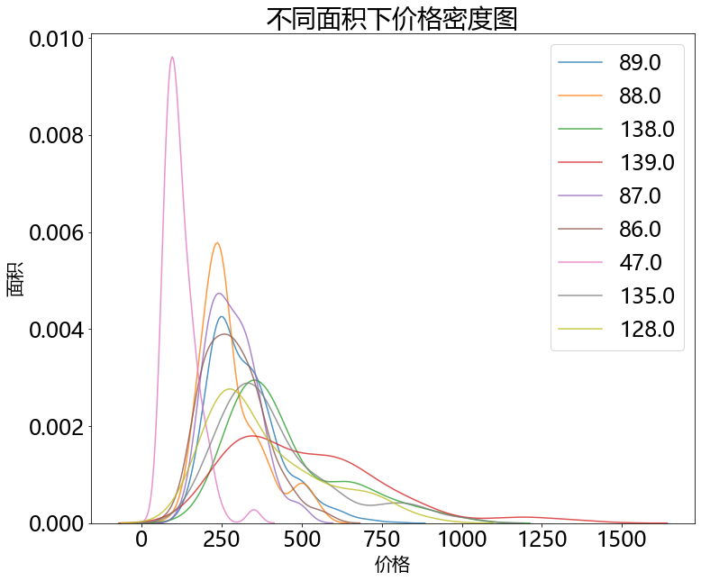


不同面积对结果影响不同，我们要好好利用这个变量

## 3.2 多变量绘图


```python
plt.figure(figsize=(12,10))
           
           
sns.relplot(data=dataset,x='面积',y='价格',hue='室')
```


    <seaborn.axisgrid.FacetGrid at 0x1fea7988a48>


    <Figure size 864x720 with 0 Axes>


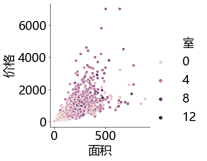


可以看出面积与价格呈现正相关性，但面积越大，价格分布也分散，说明大面积房子价格差距较大；第二实数越大价格越高


```python
for label in ['车位','学区房','业主房评','VR']:
    g = sns.FacetGrid(data=dataset[dataset['价格']<1000],hue=label,height=6,aspect=.8)
    g.map(sns.distplot,'价格')
    plt.title('%s对价格的影响'%label)
    
```


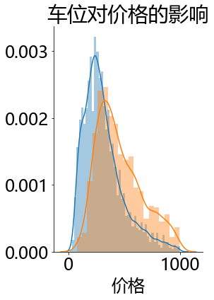


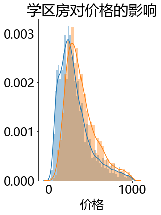


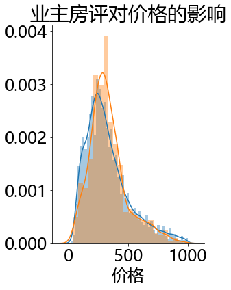


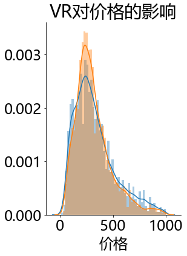


可以看出是否有车位，是否是学区房，是否有业主房评对价格影响较大，是否vr影响不是太大


```python
subdata = dataset[['价格','面积','室']]
```


```python
def corr_func(x,y,**kws):
    r = np.corrcoef(x,y)[0][1]
    
    ax = plt.gca()
    ax.annotate("r = {:.2f}".format(r),
                xy=(.2, .8), xycoords=ax.transAxes,
                size = 20)
    
grid = sns.PairGrid(data=subdata,size=3)
    
grid.map_upper(plt.scatter,color='red',alpha=0.8)
    
grid.map_diag(plt.hist,color='red',alpha=0.6)
    
grid.map_lower(corr_func)
grid.map_lower(sns.kdeplot,cmap=plt.cm.Reds)

plt.suptitle('房产数据关联图', size = 36, y = 1.02)
```


    Text(0.5, 1.02, '房产数据关联图')


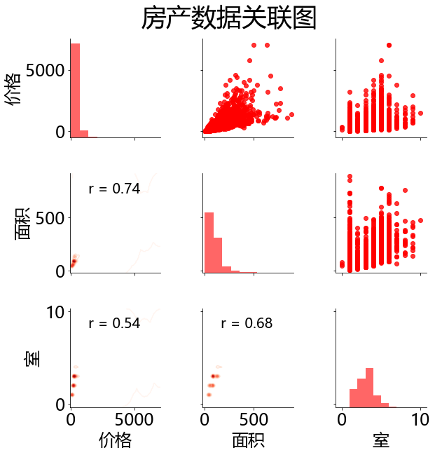


可以看出，面积和室数和价格有相关性

# 4 特征工程

## 4.1 特征组合

根据现有特征进行各种转换和组合获得更多特征


```python
dataset['总室数'] = dataset['室']+dataset['厨']+dataset['厅']+dataset['卫']
dataset['每室平均面积'] = dataset['总室数']/dataset['面积']

# 将是否有车位，是否有房评是否是地铁房相加

dataset['车学区房评'] = dataset['车位']+dataset['学区房']+ dataset['业主房评']
```

## 4.2 特征编码及转换


```python
from sklearn.preprocessing import LabelEncoder
le = LabelEncoder()
features = [x for x in dataset.columns if x != '价格']

features_data = dataset[features]
target_data = dataset['价格']


# 类别型变量
cat_subset = features_data.select_dtypes(object)
for label in cat_subset.columns:
    if label in [ '等级','地铁房']:
        cat_subset[label] = le.fit_transform(cat_subset[label])
    else:
        cat_cols = [x for x in list(cat_subset.columns) if x not in ['地铁房','等级']]
        cat_subset_2 = cat_subset[cat_cols]
        cat_subset_2 = pd.get_dummies(cat_subset_2)
cat_subset = pd.concat([cat_subset[[ '等级','地铁房']],cat_subset_2],axis=1)
                       

# 数值型变量
num_subset = features_data.select_dtypes('number')
for label in num_subset.columns:
    if label in ['面积','每室平均面积','总室数']:
        num_subset['log_'+label] = np.log(num_subset[label])
    else:
        continue

features_data = pd.concat([cat_subset,num_subset],axis=1)
```

## 4.3 特征缩放


```python
from sklearn.preprocessing import StandardScaler
sd = StandardScaler()
col = features_data.select_dtypes(include=['int64','float64']).columns
features_data[col] = sd.fit_transform(features_data[col])
```

## 4.4 特征筛选

### 4.4.1 递归特征消除
首先，选出与目标变量相关性较高的特征。这里采用的是Wrapper方法，通过暴力的递归特征消除 (Recursive Feature Elimination)方法筛选40个与目标变量相关性最强的特征，逐步剔除特征从而达到首次降维。


```python
from sklearn.ensemble import GradientBoostingRegressor
from sklearn.feature_selection import RFE

model = GradientBoostingRegressor()
rfe = RFE(model, 40)

rfe = rfe.fit(features_data,target_data)
```


```python
print(rfe.support_)
print(rfe.ranking_)
```

    [False  True False False False False False False False False False False
     False False False False False False False False False False False False
     False False False False False False False False False False  True False
     False False False False False False False False False False False False
     False False False False False False False False False False False  True
      True False  True False False False False False False False False False
     False  True False False False False False False False False False False
     False False False False False False  True  True False False False False
     False False False False False False  True False False  True False False
     False False False  True  True  True  True False False False False  True
     False  True  True False False False False False False False False False
     False False  True False False False False False False  True False False
     False False False  True False False False False False False False False
      True False  True  True  True  True False False False  True False False
     False  True  True  True  True  True  True False  True  True False False
     False  True  True  True  True  True  True]
    [ 16   1  26  23  25  24  21  22  28  20  19  14  40  39  47  44  37  29
      30  55  59  61  49  62  65  69  67  36  51  74  76  82  53  86   1  81
      83  88  91  92  95  87 102  48  75  97  54  99  18 110  58 119 100 123
     121 126 125  96 127   1   1 128   1 129 137 139 141 143 133 147 145 131
     104   1 112   9  80  79 105 118 107 113 115 117  35  34  33  31  32  10
       1   1   5 148 146 144 142 140  11 124 122 120   1 116 114   1  98   8
      94  90  13   1   1   1   1  63  38  46  42   1  56   1   1  93  89  57
      52  50  15  41  66 136  68  72   1 130  73 135  71  60  64   1   6  77
       3 101  17   1  43 109 108 111  84  85  45   4   1 138   1   1   1   1
      12  78 134   1 132 103 106   1   1   1   1   1   1   2   1   1   7  70
      27   1   1   1   1   1   1]
    


```python
col_filter = features_data.columns[rfe.support_]
col_filter
```


    Index(['地铁房', '二级委托_店面接待', '商圈_临安', '商圈_临平', '商圈_之江', '商圈_南星', '商圈_学军',
           '商圈_富阳', '商圈_文一西路', '商圈_文教', '商圈_桥西', '商圈_武林', '商圈_沿江北', '商圈_沿江南',
           '商圈_清波', '商圈_湖墅', '商圈_湖滨', '商圈_翡翠城', '商圈_西溪', '商圈_钱江新城', '商圈_黄龙',
           '城区_上城区', '城区_下城区', '城区_临安市', '城区_余杭区', '城区_拱墅区', '城区_滨江区', '城区_萧山区',
           '城区_西湖区', '面积', '室', '厅', '卫', '车位', '总室数', '每室平均面积', '车学区房评', 'log_面积',
           'log_总室数', 'log_每室平均面积'],
          dtype='object')


### 4.4.2 强相关性变量
首先，剩下的变量中有一些相关性较强，这些变量不利后面的操作，需要剔除。


```python
corrMatrix = features_data[col_filter].corr()
upTri = np.triu(corrMatrix,1)
absupTri = np.abs(upTri)
corrMatrix = pd.DataFrame(absupTri,columns=corrMatrix.columns)
colList = corrMatrix.apply(lambda x:all(x<=0.7))
col_filter_new = col_filter[colList]
features_data[col_filter_new].shape
```


    (20000, 34)


特征子集包含的变量降维至34个

# 5 建立模型，训练数据

### 5.1 划分训练数据集和测试数据集


```python
from sklearn.model_selection import train_test_split
X_train,X_test,y_train,y_test = train_test_split(features_data[col_filter_new],target_data)
```


```python
### 5.2 训练数据
```


```python
from sklearn.ensemble import GradientBoostingRegressor

gbr = GradientBoostingRegressor()
gbr.fit(X_train,y_train)
```


    GradientBoostingRegressor(alpha=0.9, criterion='friedman_mse', init=None,
                              learning_rate=0.1, loss='ls', max_depth=3,
                              max_features=None, max_leaf_nodes=None,
                              min_impurity_decrease=0.0, min_impurity_split=None,
                              min_samples_leaf=1, min_samples_split=2,
                              min_weight_fraction_leaf=0.0, n_estimators=100,
                              n_iter_no_change=None, presort='auto',
                              random_state=None, subsample=1.0, tol=0.0001,
                              validation_fraction=0.1, verbose=0, warm_start=False)


```python
from sklearn.metrics import mean_squared_error

y_pred  = gbr.predict(X_test)
mse = mean_squared_error(y_test,y_pred)
rmse = np.sqrt(mse)
print(rmse)
```

    151.166578179419
    

## 6 调参


```python
loss = ['ls', 'lad', 'huber']

# Number of trees used in the boosting process
n_estimators = [100, 500, 900, 1100, 1500]

# Maximum depth of each tree
max_depth = [2, 3, 5, 10, 15]

# Minimum number of samples per leaf
min_samples_leaf = [1, 2, 4, 6, 8]

# Minimum number of samples to split a node
min_samples_split = [2, 4, 6, 10]

# Maximum number of features to consider for making splits
max_features = ['auto', 'sqrt', 'log2', None]

# Define the grid of hyperparameters to search
hyperparameter_grid = {'loss': loss,
                       'n_estimators': n_estimators,
                       'max_depth': max_depth,
                       'min_samples_leaf': min_samples_leaf,
                       'min_samples_split': min_samples_split,
                       'max_features': max_features}
```

在gradient boosting算法中，我们选择了6组可调参数，目的就是找到他们最好的组合。

+  estimator: the model
+  param_distributions: the distribution of parameters we defined
+  cv the number of folds to use for k-fold cross validation
+  n_iter: the number of different combinations to try
+  scoring: which metric to use when evaluating candidates
+  n_jobs: number of cores to run in parallel (-1 will use all available)
+  verbose: how much information to display (1 displays a limited amount)
+  return_train_score: return the training score for each cross-validation fold
+  random_state: fixes the random number generator used so we get the same results every run


```python
from sklearn.model_selection import RandomizedSearchCV
from sklearn.model_selection import GridSearchCV

model = GradientBoostingRegressor(random_state = 42)

random_cv = RandomizedSearchCV(estimator = model,
                               param_distributions=hyperparameter_grid,
                               cv=4,
                               n_iter=25,
                               scoring='neg_mean_absolute_error',
                               n_jobs=-1,
                               verbose=1,
                               return_train_score=True,
                               random_state=42)

```


```python
random_cv.fit(X_train,y_train)
```

    Fitting 4 folds for each of 25 candidates, totalling 100 fits
    

    [Parallel(n_jobs=-1)]: Using backend LokyBackend with 12 concurrent workers.
    [Parallel(n_jobs=-1)]: Done  26 tasks      | elapsed:   53.1s
    [Parallel(n_jobs=-1)]: Done 100 out of 100 | elapsed:  4.0min finished
    


    RandomizedSearchCV(cv=4, error_score='raise-deprecating',
                       estimator=GradientBoostingRegressor(alpha=0.9,
                                                           criterion='friedman_mse',
                                                           init=None,
                                                           learning_rate=0.1,
                                                           loss='ls', max_depth=3,
                                                           max_features=None,
                                                           max_leaf_nodes=None,
                                                           min_impurity_decrease=0.0,
                                                           min_impurity_split=None,
                                                           min_samples_leaf=1,
                                                           min_samples_split=2,
                                                           min_weight_fraction_leaf=0.0,
                                                           n_estimators=100,...
                       iid='warn', n_iter=25, n_jobs=-1,
                       param_distributions={'loss': ['ls', 'lad', 'huber'],
                                            'max_depth': [2, 3, 5, 10, 15],
                                            'max_features': ['auto', 'sqrt', 'log2',
                                                             None],
                                            'min_samples_leaf': [1, 2, 4, 6, 8],
                                            'min_samples_split': [2, 4, 6, 10],
                                            'n_estimators': [100, 500, 900, 1100,
                                                             1500]},
                       pre_dispatch='2*n_jobs', random_state=42, refit=True,
                       return_train_score=True, scoring='neg_mean_absolute_error',
                       verbose=1)


```python
random_results = pd.DataFrame(random_cv.cv_results_).sort_values('mean_test_score',ascending = False)
random_results.head(10)
```


<div>
<style scoped>
    .dataframe tbody tr th:only-of-type {
        vertical-align: middle;
    }

    .dataframe tbody tr th {
        vertical-align: top;
    }

    .dataframe thead th {
        text-align: right;
    }
</style>
<table border="1" class="dataframe">
  <thead>
    <tr style="text-align: right;">
      <th></th>
      <th>mean_fit_time</th>
      <th>std_fit_time</th>
      <th>mean_score_time</th>
      <th>std_score_time</th>
      <th>param_n_estimators</th>
      <th>param_min_samples_split</th>
      <th>param_min_samples_leaf</th>
      <th>param_max_features</th>
      <th>param_max_depth</th>
      <th>param_loss</th>
      <th>params</th>
      <th>split0_test_score</th>
      <th>split1_test_score</th>
      <th>split2_test_score</th>
      <th>split3_test_score</th>
      <th>mean_test_score</th>
      <th>std_test_score</th>
      <th>rank_test_score</th>
      <th>split0_train_score</th>
      <th>split1_train_score</th>
      <th>split2_train_score</th>
      <th>split3_train_score</th>
      <th>mean_train_score</th>
      <th>std_train_score</th>
    </tr>
  </thead>
  <tbody>
    <tr>
      <td>5</td>
      <td>7.678985</td>
      <td>0.214819</td>
      <td>0.080573</td>
      <td>0.008054</td>
      <td>900</td>
      <td>6</td>
      <td>8</td>
      <td>log2</td>
      <td>5</td>
      <td>lad</td>
      <td>{'n_estimators': 900, 'min_samples_split': 6, ...</td>
      <td>-70.855356</td>
      <td>-69.566614</td>
      <td>-71.887293</td>
      <td>-69.216923</td>
      <td>-70.381547</td>
      <td>1.062101</td>
      <td>1</td>
      <td>-58.454414</td>
      <td>-58.311284</td>
      <td>-57.909737</td>
      <td>-58.793966</td>
      <td>-58.367350</td>
      <td>0.317070</td>
    </tr>
    <tr>
      <td>12</td>
      <td>11.509220</td>
      <td>0.160961</td>
      <td>0.032279</td>
      <td>0.001300</td>
      <td>500</td>
      <td>6</td>
      <td>6</td>
      <td>None</td>
      <td>5</td>
      <td>lad</td>
      <td>{'n_estimators': 500, 'min_samples_split': 6, ...</td>
      <td>-71.244387</td>
      <td>-70.163107</td>
      <td>-71.781271</td>
      <td>-69.110807</td>
      <td>-70.574893</td>
      <td>1.026728</td>
      <td>2</td>
      <td>-59.307819</td>
      <td>-59.415213</td>
      <td>-59.141775</td>
      <td>-58.729392</td>
      <td>-59.148550</td>
      <td>0.260871</td>
    </tr>
    <tr>
      <td>1</td>
      <td>3.266472</td>
      <td>0.044935</td>
      <td>0.018266</td>
      <td>0.000434</td>
      <td>100</td>
      <td>6</td>
      <td>8</td>
      <td>sqrt</td>
      <td>10</td>
      <td>huber</td>
      <td>{'n_estimators': 100, 'min_samples_split': 6, ...</td>
      <td>-71.678494</td>
      <td>-69.971144</td>
      <td>-72.006701</td>
      <td>-69.478646</td>
      <td>-70.783746</td>
      <td>1.079329</td>
      <td>3</td>
      <td>-57.623972</td>
      <td>-58.266798</td>
      <td>-57.731291</td>
      <td>-58.478617</td>
      <td>-58.025170</td>
      <td>0.357534</td>
    </tr>
    <tr>
      <td>13</td>
      <td>11.646590</td>
      <td>0.385792</td>
      <td>0.091333</td>
      <td>0.003635</td>
      <td>1500</td>
      <td>10</td>
      <td>1</td>
      <td>sqrt</td>
      <td>5</td>
      <td>lad</td>
      <td>{'n_estimators': 1500, 'min_samples_split': 10...</td>
      <td>-71.860935</td>
      <td>-70.319194</td>
      <td>-71.553286</td>
      <td>-69.626593</td>
      <td>-70.840002</td>
      <td>0.907563</td>
      <td>4</td>
      <td>-54.417117</td>
      <td>-54.632748</td>
      <td>-53.641326</td>
      <td>-54.859796</td>
      <td>-54.387747</td>
      <td>0.458493</td>
    </tr>
    <tr>
      <td>4</td>
      <td>42.906770</td>
      <td>0.362236</td>
      <td>0.209440</td>
      <td>0.002864</td>
      <td>900</td>
      <td>6</td>
      <td>6</td>
      <td>sqrt</td>
      <td>15</td>
      <td>lad</td>
      <td>{'n_estimators': 900, 'min_samples_split': 6, ...</td>
      <td>-71.427604</td>
      <td>-69.765975</td>
      <td>-71.989864</td>
      <td>-70.286704</td>
      <td>-70.867537</td>
      <td>0.883756</td>
      <td>5</td>
      <td>-33.750601</td>
      <td>-32.794791</td>
      <td>-33.331794</td>
      <td>-33.725707</td>
      <td>-33.400723</td>
      <td>0.387277</td>
    </tr>
    <tr>
      <td>24</td>
      <td>2.790286</td>
      <td>0.068562</td>
      <td>0.019017</td>
      <td>0.000708</td>
      <td>100</td>
      <td>4</td>
      <td>8</td>
      <td>sqrt</td>
      <td>10</td>
      <td>lad</td>
      <td>{'n_estimators': 100, 'min_samples_split': 4, ...</td>
      <td>-71.132954</td>
      <td>-70.805050</td>
      <td>-71.736626</td>
      <td>-69.856198</td>
      <td>-70.882707</td>
      <td>0.680359</td>
      <td>6</td>
      <td>-60.665342</td>
      <td>-60.349186</td>
      <td>-59.835685</td>
      <td>-60.394766</td>
      <td>-60.311245</td>
      <td>0.299982</td>
    </tr>
    <tr>
      <td>11</td>
      <td>36.714889</td>
      <td>0.722252</td>
      <td>0.206437</td>
      <td>0.002589</td>
      <td>1500</td>
      <td>2</td>
      <td>4</td>
      <td>log2</td>
      <td>10</td>
      <td>lad</td>
      <td>{'n_estimators': 1500, 'min_samples_split': 2,...</td>
      <td>-71.671951</td>
      <td>-70.285919</td>
      <td>-72.160663</td>
      <td>-69.437541</td>
      <td>-70.889018</td>
      <td>1.084041</td>
      <td>7</td>
      <td>-38.005662</td>
      <td>-36.657222</td>
      <td>-37.865206</td>
      <td>-37.313038</td>
      <td>-37.460282</td>
      <td>0.531034</td>
    </tr>
    <tr>
      <td>3</td>
      <td>12.975545</td>
      <td>0.187925</td>
      <td>0.032780</td>
      <td>0.003034</td>
      <td>500</td>
      <td>6</td>
      <td>8</td>
      <td>None</td>
      <td>5</td>
      <td>huber</td>
      <td>{'n_estimators': 500, 'min_samples_split': 6, ...</td>
      <td>-71.087574</td>
      <td>-71.124492</td>
      <td>-71.752811</td>
      <td>-69.632943</td>
      <td>-70.899455</td>
      <td>0.777544</td>
      <td>8</td>
      <td>-54.453259</td>
      <td>-53.982127</td>
      <td>-53.726974</td>
      <td>-54.963770</td>
      <td>-54.281533</td>
      <td>0.472260</td>
    </tr>
    <tr>
      <td>21</td>
      <td>5.498151</td>
      <td>0.184493</td>
      <td>0.037034</td>
      <td>0.001415</td>
      <td>500</td>
      <td>6</td>
      <td>4</td>
      <td>log2</td>
      <td>5</td>
      <td>huber</td>
      <td>{'n_estimators': 500, 'min_samples_split': 6, ...</td>
      <td>-71.325786</td>
      <td>-70.193631</td>
      <td>-72.597840</td>
      <td>-70.131085</td>
      <td>-71.062086</td>
      <td>1.006113</td>
      <td>9</td>
      <td>-57.447227</td>
      <td>-56.922633</td>
      <td>-56.589516</td>
      <td>-57.082075</td>
      <td>-57.010363</td>
      <td>0.308546</td>
    </tr>
    <tr>
      <td>10</td>
      <td>55.541764</td>
      <td>2.099686</td>
      <td>0.125614</td>
      <td>0.002294</td>
      <td>1100</td>
      <td>10</td>
      <td>6</td>
      <td>None</td>
      <td>10</td>
      <td>huber</td>
      <td>{'n_estimators': 1100, 'min_samples_split': 10...</td>
      <td>-72.146550</td>
      <td>-70.699549</td>
      <td>-72.899272</td>
      <td>-70.842729</td>
      <td>-71.647025</td>
      <td>0.916822</td>
      <td>10</td>
      <td>-31.767633</td>
      <td>-33.479507</td>
      <td>-31.923965</td>
      <td>-34.263100</td>
      <td>-32.858551</td>
      <td>1.051415</td>
    </tr>
  </tbody>
</table>
</div>


```python
random_cv.best_estimator_
```


    GradientBoostingRegressor(alpha=0.9, criterion='friedman_mse', init=None,
                              learning_rate=0.1, loss='lad', max_depth=5,
                              max_features='log2', max_leaf_nodes=None,
                              min_impurity_decrease=0.0, min_impurity_split=None,
                              min_samples_leaf=8, min_samples_split=6,
                              min_weight_fraction_leaf=0.0, n_estimators=900,
                              n_iter_no_change=None, presort='auto',
                              random_state=42, subsample=1.0, tol=0.0001,
                              validation_fraction=0.1, verbose=0, warm_start=False)


```python
tree_grid = {'n_estimators':list(range(200,1000,50))}
```


```python
model = GradientBoostingRegressor(loss='lad',max_depth=5,min_samples_leaf=8,min_samples_split=6,max_features='log2')
grid_cv = GridSearchCV(estimator=model,param_grid=tree_grid,cv = 4, 
                           scoring = 'neg_mean_absolute_error', verbose = 1,
                           n_jobs = -1, return_train_score = True)
```


```python
grid_cv.fit(X_train,y_train)
```

    Fitting 4 folds for each of 16 candidates, totalling 64 fits
    

    [Parallel(n_jobs=-1)]: Using backend LokyBackend with 12 concurrent workers.
    [Parallel(n_jobs=-1)]: Done  26 tasks      | elapsed:   13.4s
    [Parallel(n_jobs=-1)]: Done  64 out of  64 | elapsed:   34.7s finished
    


    GridSearchCV(cv=4, error_score='raise-deprecating',
                 estimator=GradientBoostingRegressor(alpha=0.9,
                                                     criterion='friedman_mse',
                                                     init=None, learning_rate=0.1,
                                                     loss='lad', max_depth=5,
                                                     max_features='log2',
                                                     max_leaf_nodes=None,
                                                     min_impurity_decrease=0.0,
                                                     min_impurity_split=None,
                                                     min_samples_leaf=8,
                                                     min_samples_split=6,
                                                     min_weight_fraction_leaf=0.0,
                                                     n_estimators=100,
                                                     n_iter_no_change=None,
                                                     presort='auto',
                                                     random_state=None,
                                                     subsample=1.0, tol=0.0001,
                                                     validation_fraction=0.1,
                                                     verbose=0, warm_start=False),
                 iid='warn', n_jobs=-1,
                 param_grid={'n_estimators': [200, 250, 300, 350, 400, 450, 500,
                                              550, 600, 650, 700, 750, 800, 850,
                                              900, 950]},
                 pre_dispatch='2*n_jobs', refit=True, return_train_score=True,
                 scoring='neg_mean_absolute_error', verbose=1)


```python
results = pd.DataFrame(grid_cv.cv_results_)
plt.figure(figsize=(8,8))
plt.plot(results['param_n_estimators'], -1 * results['mean_test_score'], label = 'Testing Error')
plt.plot(results['param_n_estimators'], -1 * results['mean_train_score'], label = 'Training Error')
plt.xlabel('number of trees')
plt.ylabel('Mean Abosolute Error')
plt.legend()
plt.title('Performance vs Number of Trees')
```


    Text(0.5, 1.0, 'Performance vs Number of Trees')


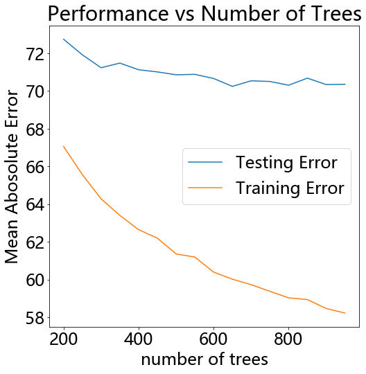


```python
results.sort_values('mean_test_score', ascending = False).head(5)
```


<div>
<style scoped>
    .dataframe tbody tr th:only-of-type {
        vertical-align: middle;
    }

    .dataframe tbody tr th {
        vertical-align: top;
    }

    .dataframe thead th {
        text-align: right;
    }
</style>
<table border="1" class="dataframe">
  <thead>
    <tr style="text-align: right;">
      <th></th>
      <th>mean_fit_time</th>
      <th>std_fit_time</th>
      <th>mean_score_time</th>
      <th>std_score_time</th>
      <th>param_n_estimators</th>
      <th>params</th>
      <th>split0_test_score</th>
      <th>split1_test_score</th>
      <th>split2_test_score</th>
      <th>split3_test_score</th>
      <th>mean_test_score</th>
      <th>std_test_score</th>
      <th>rank_test_score</th>
      <th>split0_train_score</th>
      <th>split1_train_score</th>
      <th>split2_train_score</th>
      <th>split3_train_score</th>
      <th>mean_train_score</th>
      <th>std_train_score</th>
    </tr>
  </thead>
  <tbody>
    <tr>
      <td>9</td>
      <td>6.092402</td>
      <td>0.158120</td>
      <td>0.050046</td>
      <td>0.001226</td>
      <td>650</td>
      <td>{'n_estimators': 650}</td>
      <td>-70.647662</td>
      <td>-69.334053</td>
      <td>-71.264978</td>
      <td>-69.714356</td>
      <td>-70.240262</td>
      <td>0.760560</td>
      <td>1</td>
      <td>-60.074667</td>
      <td>-59.796490</td>
      <td>-59.691787</td>
      <td>-60.523252</td>
      <td>-60.021549</td>
      <td>0.321684</td>
    </tr>
    <tr>
      <td>12</td>
      <td>7.680984</td>
      <td>0.322320</td>
      <td>0.060555</td>
      <td>0.001119</td>
      <td>800</td>
      <td>{'n_estimators': 800}</td>
      <td>-71.533036</td>
      <td>-68.933316</td>
      <td>-71.452533</td>
      <td>-69.293577</td>
      <td>-70.303115</td>
      <td>1.196807</td>
      <td>2</td>
      <td>-58.978312</td>
      <td>-59.017415</td>
      <td>-58.308987</td>
      <td>-59.821245</td>
      <td>-59.031490</td>
      <td>0.535899</td>
    </tr>
    <tr>
      <td>14</td>
      <td>7.673745</td>
      <td>0.184583</td>
      <td>0.061056</td>
      <td>0.012915</td>
      <td>900</td>
      <td>{'n_estimators': 900}</td>
      <td>-71.028905</td>
      <td>-69.318900</td>
      <td>-71.485917</td>
      <td>-69.513146</td>
      <td>-70.336717</td>
      <td>0.937284</td>
      <td>3</td>
      <td>-57.951354</td>
      <td>-58.528364</td>
      <td>-58.316396</td>
      <td>-59.087222</td>
      <td>-58.470834</td>
      <td>0.411386</td>
    </tr>
    <tr>
      <td>15</td>
      <td>6.533112</td>
      <td>0.347229</td>
      <td>0.052548</td>
      <td>0.004980</td>
      <td>950</td>
      <td>{'n_estimators': 950}</td>
      <td>-70.955538</td>
      <td>-69.447839</td>
      <td>-71.396484</td>
      <td>-69.601496</td>
      <td>-70.350339</td>
      <td>0.842015</td>
      <td>4</td>
      <td>-57.858286</td>
      <td>-58.059700</td>
      <td>-57.981586</td>
      <td>-58.999878</td>
      <td>-58.224862</td>
      <td>0.453180</td>
    </tr>
    <tr>
      <td>11</td>
      <td>7.219042</td>
      <td>0.464950</td>
      <td>0.065435</td>
      <td>0.008663</td>
      <td>750</td>
      <td>{'n_estimators': 750}</td>
      <td>-70.805988</td>
      <td>-69.448514</td>
      <td>-71.634883</td>
      <td>-70.110726</td>
      <td>-70.500028</td>
      <td>0.812211</td>
      <td>5</td>
      <td>-59.042560</td>
      <td>-59.277807</td>
      <td>-59.191069</td>
      <td>-59.999440</td>
      <td>-59.377719</td>
      <td>0.368676</td>
    </tr>
  </tbody>
</table>
</div>


从上图中可以明显看出我们的模型出现了过拟合现象，随着树的个数增多，过拟合现象越来越明显。

由上图可知，对于树的个数，最好的参数是650。


```python
final_model = grid_cv.best_estimator_
default_model = GradientBoostingRegressor(random_state = 42)
```


```python
final_model
```


    GradientBoostingRegressor(alpha=0.9, criterion='friedman_mse', init=None,
                              learning_rate=0.1, loss='lad', max_depth=5,
                              max_features='log2', max_leaf_nodes=None,
                              min_impurity_decrease=0.0, min_impurity_split=None,
                              min_samples_leaf=8, min_samples_split=6,
                              min_weight_fraction_leaf=0.0, n_estimators=650,
                              n_iter_no_change=None, presort='auto',
                              random_state=None, subsample=1.0, tol=0.0001,
                              validation_fraction=0.1, verbose=0, warm_start=False)


```python
final_model.fit(X_train,y_train)
default_model.fit(X_train,y_train)
```


    GradientBoostingRegressor(alpha=0.9, criterion='friedman_mse', init=None,
                              learning_rate=0.1, loss='ls', max_depth=3,
                              max_features=None, max_leaf_nodes=None,
                              min_impurity_decrease=0.0, min_impurity_split=None,
                              min_samples_leaf=1, min_samples_split=2,
                              min_weight_fraction_leaf=0.0, n_estimators=100,
                              n_iter_no_change=None, presort='auto',
                              random_state=42, subsample=1.0, tol=0.0001,
                              validation_fraction=0.1, verbose=0, warm_start=False)


```python
default_pred = default_model.predict(X_test)
final_pred = final_model.predict(X_test)

print('Default model performance on the test set: RMSE = %0.4f.' % np.sqrt(mean_squared_error(y_test, default_pred)))
print('Final model performance on the test set:   RMSE = %0.4f.' % np.sqrt(mean_squared_error(y_test, final_pred)))
```

    Default model performance on the test set: RMSE = 148.8444.
    Final model performance on the test set:   RMSE = 134.9000.
    


```python
plt.figure(figsize=(8,6))


sns.kdeplot(final_pred,label='Predictions')
sns.kdeplot(y_test,label='Values')

plt.xlabel('Energy Star Score')
plt.ylabel('Density')
plt.title('Test Values and Predicitions')
```


    Text(0.5, 1.0, 'Test Values and Predicitions')


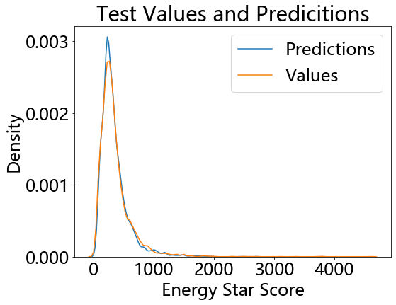


预测和真实之间的差异图（上图）


```python
plt.figure(figsize=(8,6))

residuals = final_pred - y_test

sns.distplot(residuals,color = 'red', bins = 20)
plt.xlabel('Error'); plt.ylabel('Count')
plt.title('Distribution of Residuals')
```


    Text(0.5, 1.0, 'Distribution of Residuals')


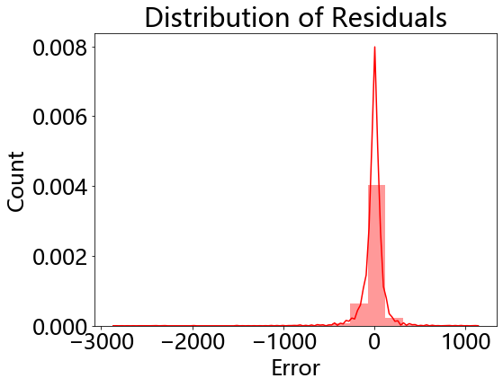


残差分布情况


```python

```
